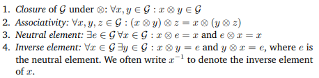
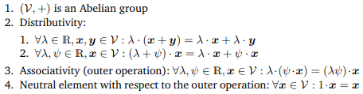

# Day002 - Ch 02. Linear Algebra

- **Date**: 2026-05-28
- **Textbook**: Mathematics for Machine Learning (MML) - Ch 02. Linear Algebra

## Core Concepts

### 1. Groups

A group is a mathematical structure consisting of:

$$
(G, \otimes)
$$

where:

- $G$ is a set of elements.
- $\otimes$ is an operation defined on elements of $G$.

### 2. Vector Spaces

A vector space is a mathematical structure:

$$
(V,+,\cdot)
$$

## AI-Driven Tech Interview Q&A

### Q1. What is the difference between a Group and a Vector Space?

**Answer**:
A group is a mathematical structure consisting of a set and a single operation that satisfies properties such as closure, associativity, identity, and inverse elements. The focus of a group is whether the operation between elements is mathematically valid within the set.

A vector space extends this idea further. In addition to vector addition, a vector space also includes scalar multiplication. This means vectors can not only be added together, but also scaled by numbers from a field such as $\mathbb{R}$.

Every vector space forms a group under vector addition, but not every group is a vector space because groups do not necessarily support scalar multiplication. In machine learning, vector spaces are especially important because data, embeddings, and tensors are commonly represented as vectors inside high-dimensional spaces.

## Daily Reflection
I struggle to read and interpret mathematical notation. I realize my English proficiency and textbook reading skills are still lacking.
